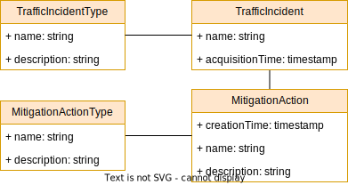

# Introduction
AI cockpit aims at building a human control interface to AI systems. It is supposed to cover requirements from EU's AI act. More details can be found at https://www.kicockpit.eu/. All shared components necessary for this repo can be found [here](https://github.com/KI-Cockpit/ai-cockpit-api). There you also can find more info about all other activities & results of this project.

# Development Setup
This section describes how to run this software on your machine. 

## Prerequisites
The following components and tools are necessary to build & run AICockpit in your dev environment.

* Java JDK 21 or later
* Maven 3
* NodeJs (16.9.1) and NPM (8.3.2) - [NodeJS Install](https://nodejs.org/en/download/package-manager/)
* Postgres (available for development via docker-compose scripts)
* using Keycloak is optional

### Maven Dependency
Project needs a library from an AI cockpit Github repo and thus you need to adapt your Maven settings (usually located here ~/.m2/settings.xml). Following example of a complete settings.xml shows you necessary additions. Please note, that you need username/Github token replaced by values, from your user.

```XML
<settings xmlns="http://maven.apache.org/SETTINGS/1.0.0"
  xmlns:xsi="http://www.w3.org/2001/XMLSchema-instance"
  xsi:schemaLocation="http://maven.apache.org/SETTINGS/1.0.0
                      http://maven.apache.org/xsd/settings-1.0.0.xsd">

  <activeProfiles>
    <activeProfile>github</activeProfile>
  </activeProfiles>

  <profiles>
    <profile>
      <id>github</id>
      <repositories>
        <repository>
          <id>central</id>
          <url>https://repo1.maven.org/maven2</url>
        </repository>
        <repository>
            <id>github</id>
            <url>https://maven.pkg.github.com/starwit/vision-api</url>
            <snapshots>
                <enabled>true</enabled>
            </snapshots>
        </repository>
      </repositories>
    </profile>
  </profiles>

  <servers>
    <server>
      <id>github</id>
      <username>username</username>
      <password>TOKEN</password>
    </server>
  </servers>
</settings>
```

## Version update

* mvn -B build-helper:parse-version versions:set -DnewVersion=\${parsedVersion.majorVersion}.\${parsedVersion.nextMinorVersion}.\0\${parsedVersion.qualifier?} versions:commit
* mvn -B release:clean release:prepare -Darguments="-DskipTests"
* mvn -B release:clean
* mvn -B release:update-versions
* mvn versions:set -DremoveSnapshot
* changelog convetions: https://www.conventionalcommits.org/en/v1.0.0/

## Installation Steps

:exclamation: Each step is executed from the project home directory.

1) go to the deployment folder and start the environment (database and keycloak) via docker-compose:

    ```bash
    cd deployment
    docker compose up
    ```

2) go to `webclient/app` and install the frontend applications dependencies

    ```bash
    cd webclient/app
    npm install
    ```

3) build the project

    ```bash
    mvn clean install -P frontend
    ```

4) start project

    ```bash
    java -jar application/target/application-0.0.1-SNAPSHOT.jar
    ```
   You can also run the main-class via Visual Studio Code.


* **application can be reached under http://localhost:8081/ai-cockpit/**
* **swagger under http://localhost:8081/ai-cockpit/swagger-ui/**
* **If you are using keycloak:**
    * **default user/password is admin/admin**
    * **keycloak can be reached under http://localost:8081/auth**

## Debugging

### Frontend Debugging

For debugging, you can start the frontend separately.

```shell
cd webclient/app
npm start
```
NPM server starts under localhost:3000/starwit/ by default

! If you are using the installation with keycloak, make sure you are logged in before first usage - just go to localhost:8081/starwit in your browser.

### Backend Debugging

You can start the spring boot application in debug mode. See Spring Boot documentation for further details. The easiest way is, to use debug functionality integrated with your IDE like VS Code.

## Postgres Client

The database is available under localhost:3006

```
Username:starwit
Database:starwit
Password:starwit
```
PGAdmin is recommended to access database for development purpose. It can be deployed via docker-compose file.

## Starting without keycloak

If you want to start your application without keycloak, you need to change spring boot profile to dev in application\src\main\resources\application.properties.

```properties
spring.profiles.active=dev
```

or define env-variable

```bash
SPRING_PROFILES_ACTIVE=dev
```

Start the database without keycloak:

```bash
cd deployment
docker compose up
```

# Deployment

see https://github.com/starwit/ai-cockpit-deployment

# Architecture & Concepts

## Data Model

