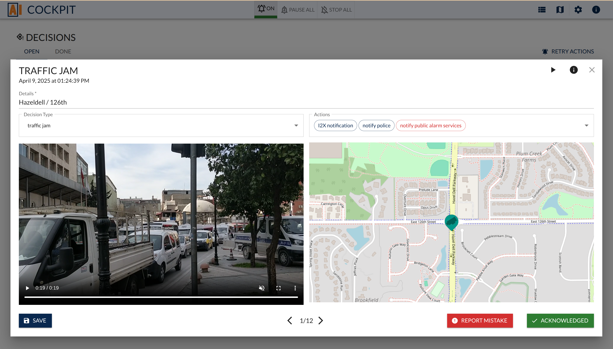
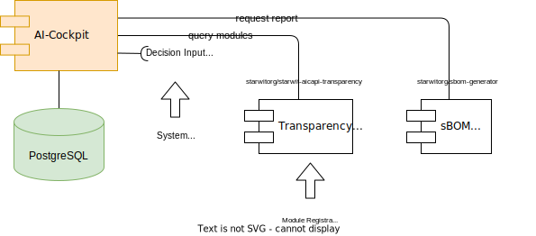

# Starwit's AI Cockpit

AI cockpit aims at building a human control interface to AI systems. It is supposed to cover requirements from EU's AI act. More details can be found at <https://www.kicockpit.eu/>. All shared components necessary for this repo can be found [here](https://github.com/KI-Cockpit/ai-cockpit-api). There you also can find more info about all other activities & results of this project.

This software is __open source__ and it is intended to be used a large community of software developers, deployers and operators. Usage and modifications are strongly encouraged - see [contribution guide](docs/CONTRIBUTION.MD) on how to get involved.

## Contact & Contribution

The “KI-Cockpit” (AI Cockpit) project was funded by the Federal Ministry of Labor and Social Affairs and executed by the nexus Institute, Aalen University, the University of Stuttgart, Chemistree, Caritas Dortmund & Starwit Technologies with the support of Awesome Technologies Innovationslabor, the Institute for Innovation and Technology (iit) at VDI/VDE Innovation + Technik and keytec.

## Deployment

Cockpit is a part of a bundle of services. For deployment options see <https://github.com/starwit/ai-cockpit-deployment>

## Development

* For details on how to develop, build and run AI Cockpit see [development instructions](docs/README-DEV.MD).
* Informations about the build pipelines can be found [here](.github/workflows/readme.md).

## Architecture & Concepts

AI Cockpit is composed by a number of components. The following diagram shows, how those components are working together.
Cockpit has three main interfaces:

* Decision - here a system landscape will announce results of interpreting a problem/anomaly
* Action - Operators can approve/disapprove proposed actions
* Transparency - every module making decisions or executing actions, has to register via this interface. Registration will cover all necessary information for deployer/operators.

A more detailed look into AI Cockpit's architecture can be found [here](docs/ARCHITECTURE.MD).

Interaction design and concepts to stay humans in control are described [here](docs/CONCEPTS.MD). A quick intro can be found at [Youtube](https://www.youtube.com/watch?v=fwruWipZFng).

### Data Model

AI Cockpit needs a data model to collect system decisions and possible actions. Data definition are described [here](https://github.com/KI-Cockpit/ai-cockpit-api/blob/main/doc/domain-model.md#simplified-model).

## License

Software in this repository is licensed under the AGPL-3.0 license. See [license agreement](LICENSE) for more details.
