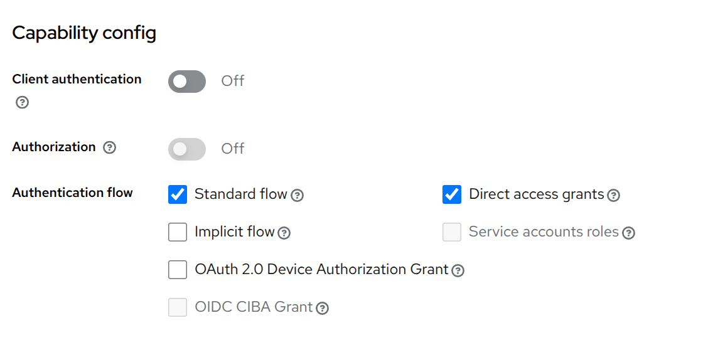
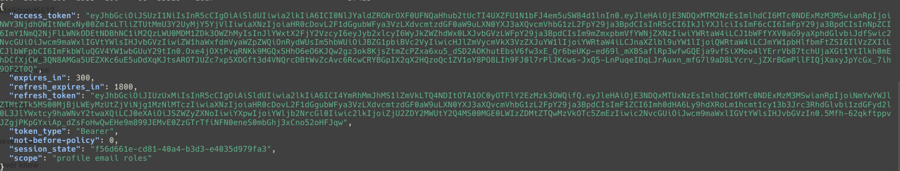

# Development Information

This document shall help developers to run AI Cockpit locally and start developing.

## Prerequisites

The following components and tools are necessary to build & run AICockpit in your dev environment.

* Java JDK 21 or later
* Maven 3
* Node (22) and NPM (11) - [NodeJS Install](https://nodejs.org/en/download/package-manager/)
* Postgres (available for development via docker-compose scripts)
* using Keycloak is optional

## How to build

In order to run a local development environment execute the following steps.
__Please note__: all steps need to be executed from base folder of repositories.

1) go to the deployment folder and start the environment (database and keycloak) via docker-compose:

    ```bash
    cd deployment
    docker compose up
    ```

2) go to `webclient/app` and install the frontend applications dependencies

    ```bash
    cd webclient/app
    npm install
    ```

3) build the project

    ```bash
    mvn clean install -P frontend
    ```

    There are two layout options. If you want to build your application with KI-Cockpit layout, you need to set environment variable VITE_THEME=kic VITE_THEME=kic and VITE_TITLE="Human in Command" before starting the build.

4) start project

    ```bash
    java -jar application/target/application-0.0.1-SNAPSHOT.jar
    ```

Once all steps ran successfully application will be reachable with the following coordinates:

* application can be reached under <http://localhost:8081/ai-cockpit/>
* swagger under <http://localhost:8081/ai-cockpit/swagger-ui/>
* If you are using keycloak:
  * default user/password is admin/admin
  * keycloak can be reached under <http://localost:8081/auth>

### Optional Minio

If you want to start the Application with Minio then you need to run:

  ```bash
    cd deployment
    docker compose -f docker-compose-minio up
  ```

The Minio WebApp is available under localhost:9001 and the shell Application is available under localhost:9000.
You need to upload a videos a bucket named __anomalies__ link video files in decision data accordingly.

### Test Action Execution

* start [alert-viewer](https://github.com/starwit/alert-viewer)
* add endpoint to your demodata:

  ```json
    {
      "state": "NEW",
      "endpoint": "localhost:8080/api/alert",
      "decisionType": {
        "id": 1
      },
      "action": []
    }
  ```

* start project

### Run demo setups

AI cockpit is aimed to serve in as many application domains as possible. Thus cockpit can be started such that decision and action types can be imported. This is controlled by two fields in application properties:

```bash
# setup scenario & demo data
scenario.setup=true
scenario.importFolder=experiment-setup/data_structures/traffic-en/
```

In folder [experiment-setup](experiment-setup/) you will find a growing number of demo data sets. Each folder can contain three files

* actiontypes.json - Definition of possible action types
* decisiontypes.json - Definition of possible analysis results
* demodata.json - actual samples for observed/analyzed situtions and proposed actions
* moduledata.json - Contains module definition

File with demo data can contain marker __DATETIME__ as value for decision creation time. This will then on import be replaced by a date time in the past relative to import time.

#### Timed decision import to local dev instances

If you want to insert actual decisions you can use a script in folder experiment-setup. Please note, that these are just demodata - do not import them into productive instances. Import script can be used as follows:
example usage:

  ```bash
    cd experiment-setup
    ./fillDatabaseScript.sh
  ```

Please note, that this script expects an _env.sh_ file in the same folder. Content can be derived from [template](../experiment-setup/env.sh.template).

This script also allows you, to test how decisions are flowing into AI Cockpit. __Note__: you will
have to prepare video data on a Minio instance.

## Debugging

### Frontend Debugging

For debugging, you can start the frontend separately.

```shell
cd webclient/app
npm start
```

If you want to build your application with KI-Cockpit layout, you need to set environment variable VITE_THEME=kic and VITE_TITLE="Human in Command" before starting the build. or execute:

```shell
export VITE_TITLE="Human in Command"
export VITE_THEME="kic"

npm start
```

NPM server starts under localhost:3000/starwit/ by default

! If you are using the installation with keycloak, make sure you are logged in before first usage - just go to localhost:8081/starwit in your browser.

### Backend Debugging

You can start the spring boot application in debug mode. See Spring Boot documentation for further details. The easiest way is, to use debug functionality integrated with your IDE like VS Code.

### Postgres Client

The database is available under localhost:3006

```properties
Username:starwit
Database:starwit
Password:starwit
```

PGAdmin is recommended to access database for development purpose. It can be deployed via docker-compose file.

## Authentication

Application can (and should) be started with authentication via an identity provider (IdP). All examples here are based on [Keycloak](https://www.keycloak.org/) as IdP.

### Starting with/without Keycloak/Authentication

If you want to start your application without keycloak, you need to change spring boot profile to dev in application\src\main\resources\application.properties. If you want to check authentication locally, use auth-dev profile and `auth-docker-compose.yaml` to start keycloak and setup realm.

```properties
spring.profiles.active=dev
```

or define env-variable

```bash
SPRING_PROFILES_ACTIVE=dev
```

Start the database without keycloak:

```bash
cd deployment
docker compose up
```

## Setup with authentication

In order to test you need to setup a Keycloak instance and there a client needs to be configured like so:



Adjust and add the following entries to your local application property file. Replace coordinates according to your Keycloak configuration and use spring profile `SPRING_PROFILES_ACTIVE=auth`

```properties
spring.security.oauth2.resourceserver.jwt.issuer-uri=http://localhost:8080/realms/aicockpit
oidc-client-registration.authorization-uri=http://localhost:8080/realms/aicockpit/protocol/openid-connect/auth
oidc-client-registration.token-uri=http://localhost:8080/realms/aicockpit/protocol/openid-connect/token
oidc-client-registration.user-info-uri=http://localhost:8080/realms/aicockpit/protocol/openid-connect/userinfo
oidc-client-registration.jwk-set-uri=http://localhost:8080/realms/aicockpit/protocol/openid-connect/certs
oidc-client-registration.end-session-endpoint=http://localhost:8080/realms/aicockpit/protocol/openid-connect/logout
oidc-client-registration.user-name-attribute=preferred_username
oidc-client-registration.scope=openid
oidc-client-registration.client-id=client-id
oidc-client-registration.client-secret=secret
oidc-client-registration.redirect-uri={baseUrl}/login/oauth2/code/{registrationId}
```

### Use API as resource server

Once security configuration is correct, you can access application API by requesting an access token from Keycloak. If you want to test this manually, use a command like this:

```bash
curl -H application/x-www-form-urlencoded -d "realm=default" -d "client_id=client_id" -d "username=name" -d "password=password" -d "grant_type=password" "http://hostname/realms/ai-cockpit/protocol/openid-connect/token"
```

If you want to extract token as variable, the following code does that:

```bash
TOKEN=`curl -H application/x-www-form-urlencoded -d "realm=default" -d "client_id=client_id" -d "username=admin" -d "password=admin" -d "grant_type=password" "http://hostname/auth/realms/ai-cockpit/protocol/openid-connect/token | jq -r '.access_token'`"
```

Response will like so:


Copy content of field _access_token_ into a environment variable like so:

```bash
export TOKEN=token
```

Then you can access with curl:

```bash
 curl -i -H "Authorization: Bearer $TOKEN" localhost:8081/ai-cockpit/monitoring
```
